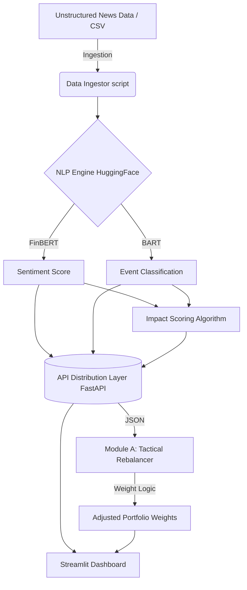

# System Architecture

Below is the Mermaid flowchart representing the complete end-to-end data flow of the Sentima Risk Engine.

```mermaid
graph TD
    A[Unstructured News Data / CSV] -->|Ingestion| B(Data Ingestor script)
    B --> C{NLP Engine HuggingFace}
    C -->|FinBERT| D[Sentiment Score]
    C -->|BART| E[Event Classification]
    D --> F[Impact Scoring Algorithm]
    E --> F
    
    D --> G[(API Distribution Layer FastAPI)]
    E --> G
    F --> G
    
    G -->|JSON| H[Module A: Tactical Rebalancer]
    H -->|Weight Logic| I[Adjusted Portfolio Weights]
    
    G --> J[Streamlit Dashboard]
    I --> J
```
